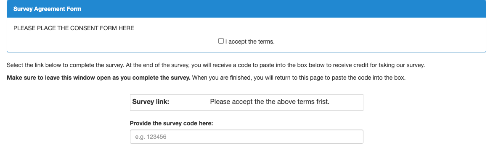
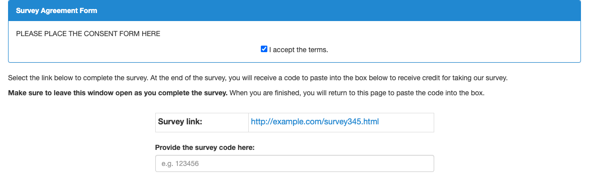

# Amazon Mechanical Turk Template for Linked Survey with Consent Form

This is a simple template to conduct the online experiment in [Amazon Mechanical Turk](https://www.mturk.com/).

First, it shows the consent form to a subject. 
When the subject accept the terms, your survey link is shown and gets enabled.

It is derived from the official example of the linked survey.

About Linked Survey: [Using Linked Surveys in MTurk](https://blog.mturk.com/editing-the-survey-link-project-template-in-the-ui-7c75285105fb)

## Reference Images
### Survey link disabled

### Surver link enabled

